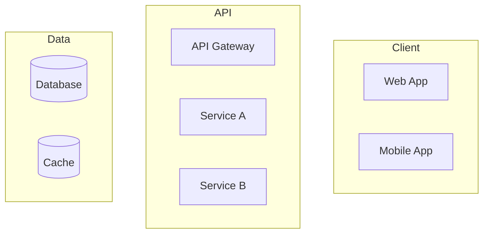

# SPARC PRD Mini v2: Modular Documentation Generator (AUTO/MANUAL)

Скилл для генерации полного пакета продуктовой документации по методологии SPARC. Модульная архитектура — использует внешние скиллы через `view()` вместо встроенных копий.

## Architecture

```
sparc-prd-mini/
├── SKILL.md                              # Оркестратор (этот файл)
├── references/
│   └── sparc-methodology.md              # SPARC framework (своё, уникальное)
└── templates/
    ├── prd.md                            # PRD template
    └── CLAUDE.md                         # AI integration guide template
```

## External Dependencies (view at runtime)

| Phase | Skill | Path | What it provides |
|-------|-------|------|------------------|
| Phase 0: Explore | `explore` | `/mnt/skills/user/explore/SKILL.md` | Socratic questioning → Product Brief |
| Phase 1: Research | `goap-research-ed25519` | `/mnt/skills/user/goap-research-ed25519/SKILL.md` | GOAP A* + OODA → Research Findings |
| Phase 2: Solve | `problem-solver-enhanced` | `/mnt/skills/user/problem-solver-enhanced/SKILL.md` | 9 modules + TRIZ → Solution Strategy |

**Принцип:** Каждый внешний скилл — Single Source of Truth. Обновление оригинала автоматически подхватывается здесь.

**Fallbacks (если скилл недоступен):**
- `explore` недоступен → встроенные Socratic questions (3-5 вопросов)
- `goap-research-ed25519` недоступен → прямой web_search по ключевым темам
- `problem-solver-enhanced` недоступен → First Principles + SCQA only

## When to Use

**Trigger Patterns:**
- "sparc-prd-mini" / "PRD mini"
- "создай PRD" / "подготовь документацию"
- "vibe coding документация"
- "SPARC документация"
- "PRD auto" / "PRD manual" / "PRD с checkpoint"
- "документация для разработки"

## Operating Modes

### AUTO Mode (Default)
```
Триггеры: "auto", "автоматически", "без остановок"
```
Все 8 фаз выполняются последовательно без промежуточных подтверждений.

### MANUAL Mode
```
Триггеры: "manual", "пошагово", "с checkpoint", "с проверками"
```
Checkpoint после каждой фазы. Пользователь подтверждает или корректирует.

**Определение режима:**
1. Явно указан → использовать указанный
2. Задача простая → предложить AUTO
3. Задача сложная → предложить MANUAL
4. Неясно → спросить

## Output Documents (11 files)

```
/output/[product-name]-sparc/
├── PRD.md                    # Product Requirements Document
├── Solution_Strategy.md      # Problem analysis (First Principles + TRIZ)
├── Specification.md          # Requirements, user stories, acceptance criteria
├── Pseudocode.md             # Algorithms, data flow, API contracts
├── Architecture.md           # System design, tech stack, diagrams
├── Refinement.md             # Edge cases, testing, optimization
├── Completion.md             # Deployment, CI/CD, monitoring
├── Research_Findings.md      # Market and technology research
├── Final_Summary.md          # Executive summary
└── .claude/
    └── CLAUDE.md             # AI tools integration guide
```

## Workflow Architecture

```
┌─────────────────────────────────────────────────────────────────┐
│  INPUT: Описание продукта/идеи                                  │
│                         ↓                                       │
│  MODE SELECTION: AUTO или MANUAL                                │
│                         ↓                                       │
│  GATE: Оценка ясности задачи                                    │
│  → Ясна? → Пропустить Explore (уведомить)                       │
│  → Не ясна? → Phase 0: Explore                                  │
│                         ↓                                       │
│  Phase 0: EXPLORE         → Product Brief                       │
│  view(explore)                                                  │
│  [MANUAL: ⏸️ CP0]                                                │
│                         ↓                                       │
│  Phase 1: RESEARCH        → Research_Findings.md                │
│  view(goap-research-ed25519)                                    │
│  [MANUAL: ⏸️ CP1]                                                │
│                         ↓                                       │
│  Phase 2: SOLVE           → Solution_Strategy.md                │
│  view(problem-solver-enhanced)                                  │
│  [MANUAL: ⏸️ CP2]                                                │
│                         ↓                                       │
│  Phase 3: SPECIFICATION   → Specification.md + PRD.md           │
│  [MANUAL: ⏸️ CP3]         (собственная логика)                   │
│                         ↓                                       │
│  Phase 4: PSEUDOCODE      → Pseudocode.md                       │
│  [MANUAL: ⏸️ CP4]         (собственная логика)                   │
│                         ↓                                       │
│  Phase 5: ARCHITECTURE    → Architecture.md                     │
│  [MANUAL: ⏸️ CP5]         (собственная логика)                   │
│                         ↓                                       │
│  Phase 6: REFINEMENT      → Refinement.md                       │
│  [MANUAL: ⏸️ CP6]         (собственная логика)                   │
│                         ↓                                       │
│  Phase 7: COMPLETION      → Completion.md + CLAUDE.md           │
│  [MANUAL: ⏸️ CP7]         (собственная логика)                   │
│                         ↓                                       │
│  SYNTHESIS                → Final_Summary.md                    │
│                         ↓                                       │
│  OUTPUT: 11 файлов                                              │
└─────────────────────────────────────────────────────────────────┘
```

---

## Phase Execution Protocol

### Gate: Task Clarity Assessment

**Задача ЯСНА (пропустить Explore), если:**
- Чётко определён продукт и его назначение
- Понятна целевая аудитория
- Указаны ключевые функции
- Ограничения явны или очевидны

**Задача НЕ ЯСНА (нужен Explore), если:**
- Размытая формулировка ("сделай приложение")
- Неизвестна целевая аудитория
- Непонятны ключевые функции
- Противоречивые требования

**При пропуске Explore:**
```
⚡ Фаза Explore пропущена — задача достаточно ясна.
Сформирован Product Brief на основе вашего запроса.
[показать Product Brief]

[AUTO: переходим к Research...]
[MANUAL: ⏸️ CHECKPOINT 0 — подтвердите или скорректируйте]
```

---

### Phase 0: EXPLORE (делегация → explore skill)

```
view("/mnt/skills/user/explore/SKILL.md")
→ Применить Socratic questioning к текущей задаче
→ Scope: уточнить продукт, аудиторию, features, constraints
```

**Output — Product Brief:**
```markdown
## Product Brief

**Product Name:** [Название]
**Problem Statement:** [Какую проблему решаем]
**Target Users:** [Целевая аудитория]
**Core Value Proposition:** [Ключевая ценность]

### Key Features (MVP)
1. [Feature 1]
2. [Feature 2]
3. [Feature 3]

### Technical Context
- Platform: [Web/Mobile/Desktop/API]
- Stack Preferences: [Если есть]
- Integrations: [Внешние системы]
- Constraints: [Ограничения]

### Success Criteria
- [Критерий 1]
- [Критерий 2]
```

**[MANUAL] CP0:**
```
═══════════════════════════════════════════════════════════════
⏸️ CHECKPOINT 0: Product Brief Complete

[показать Product Brief]

Команды:
• "ок" → перейти к Research
• "уточни X" → уточнить аспект
• "добавь Y" → добавить feature/requirement
• "измени Z" → изменить параметр

Ваше решение?
═══════════════════════════════════════════════════════════════
```

---

### Phase 1: RESEARCH (делегация → goap-research-ed25519 skill)

```
view("/mnt/skills/user/goap-research-ed25519/SKILL.md")
→ Применить GOAP planning к продуктовому research
→ State Assessment → Gap Analysis → Plan → OODA Execution
```

**Research Areas:**
- Market Research (конкуренты, тренды, размер рынка)
- Technology Research (библиотеки, frameworks, best practices)
- User Research (поведенческие паттерны, боли)
- Integration Research (APIs, compatibility)

**Output — Research_Findings.md:**
```markdown
## Research Findings

### Executive Summary
[Ключевые находки в 2-3 предложениях]

### Research Objective
[Исходные вопросы]

### Methodology
[GOAP план, источники]

### Market Analysis
[Findings с inline citations]

### Competitive Landscape
| Competitor | Strengths | Weaknesses | Differentiation |
|------------|-----------|------------|-----------------|

### Technology Assessment
[Findings с inline citations]

### User Insights
[Findings с inline citations]

### Confidence Assessment
- **High confidence:** [claims with 3+ sources]
- **Medium confidence:** [claims with 2 sources]
- **Low confidence:** [areas needing more research]

### Sources
[Нумерованный список с URLs и reliability ratings]

### Research Path Log
[Выполненные действия, replanning decisions]
```

**[MANUAL] CP1:**
```
═══════════════════════════════════════════════════════════════
⏸️ CHECKPOINT 1: Research Complete

**Ключевые находки:**
[краткое summary]

**Источники:** [число] sources, avg reliability [X.X]

Команды:
• "ок" → перейти к Solve
• "глубже X" → исследовать тему детальнее
• "добавь источники по Y" → найти больше источников
• "сравни A и B" → сравнительный анализ

Ваше решение?
═══════════════════════════════════════════════════════════════
```

---

### Phase 2: SOLVE (делегация → problem-solver-enhanced skill)

```
view("/mnt/skills/user/problem-solver-enhanced/SKILL.md")
→ Применить 9-модульный framework к продуктовой проблеме
→ Включая TRIZ для разрешения противоречий
```

**9 Modules (из problem-solver-enhanced):**
1. First Principles — разбор до фундаментальных истин
2. 5 Whys — корневая причина
3. SCQA — Situation, Complication, Question, Answer
4. Game Theory — интересы stakeholders, Nash equilibrium
5. Second-Order Thinking — последствия последствий
6. TRIZ Contradictions — 40 inventive principles
7. Design Thinking — Empathy map, HMW questions
8. OODA Loop — Observe, Orient, Decide, Act
9. Solution Synthesis — интеграция

**Output — Solution_Strategy.md:**
```markdown
## Solution Strategy

### Problem Statement (SCQA)
- **Situation:** [Стабильный контекст]
- **Complication:** [Что изменилось/проблема]
- **Question:** [Ключевой вопрос]
- **Answer:** [Предлагаемое решение]

### First Principles Analysis
[Фундаментальные истины и выводы]

### Root Cause Analysis (5 Whys)
1. Why? → [Answer 1]
2. Why? → [Answer 2]
3. Why? → [Answer 3]
4. Why? → [Answer 4]
5. Why? → [Root Cause]

### Game Theory Analysis
[Key players, interests, Nash equilibrium]

### Second-Order Effects
[Consequences of consequences]

### Contradictions Resolved (TRIZ)
| Contradiction | TRIZ Principle | Resolution |
|---------------|----------------|------------|

### Recommended Approach
[Детальное описание стратегии]

### Risk Assessment
| Risk | Probability | Impact | Mitigation |
|------|-------------|--------|------------|
```

**[MANUAL] CP2:**
```
═══════════════════════════════════════════════════════════════
⏸️ CHECKPOINT 2: Solution Strategy Complete

**Рекомендуемый подход:**
[краткое summary]

**Ключевые TRIZ решения:**
[список]

Команды:
• "ок" → перейти к Specification
• "альтернатива для X" → другой подход
• "углуби анализ Y" → детальнее по модулю
• "добавь stakeholder Z" → расширить game theory

Ваше решение?
═══════════════════════════════════════════════════════════════
```

---

### Phase 3: SPECIFICATION (собственная логика)

**Цель:** Трансформировать стратегию в детальные требования.

**Inputs:** Product Brief (Phase 0) + Research (Phase 1) + Solution (Phase 2)

**Output — Specification.md + PRD.md:**
- Executive Summary
- User Stories with Acceptance Criteria (Gherkin)
- Feature Matrix (MVP/v1/v2)
- Non-Functional Requirements (performance, security, scalability)
- Success Metrics

**User Story Format:**
```
As a [persona],
I want to [action],
So that [benefit].

Acceptance Criteria:
Given [context]
When [action]
Then [expected result]
```

**PRD Generation:**
```
view("templates/prd.md")
→ Заполнить шаблон данными из Phase 0-2
```

**[MANUAL] CP3:**
```
═══════════════════════════════════════════════════════════════
⏸️ CHECKPOINT 3: Specification Complete

**User Stories:** [число] total, [число] MVP
**NFRs:** Performance, Security, Scalability defined

Команды:
• "ок" → перейти к Pseudocode
• "добавь user story для X" → добавить
• "уточни acceptance criteria Y" → уточнить
• "измени приоритет Z" → изменить

Ваше решение?
═══════════════════════════════════════════════════════════════
```

---

### Phase 4: PSEUDOCODE (собственная логика)

**Цель:** Определить алгоритмы и data flow.

**Output — Pseudocode.md:**
```markdown
## Data Structures

### [Entity Name]
type EntityName = {
  id: UUID
  field1: Type
  field2: Type
  created_at: Timestamp
}

## Core Algorithms

### Algorithm: [Name]
INPUT: [parameters]
OUTPUT: [result]

STEPS:
1. [step]
2. [step]
3. IF [condition]:
     [action]
   ELSE:
     [action]
4. RETURN [result]

COMPLEXITY: O(n)

## API Contracts

### Endpoint: [Method] /path
Request:
  Headers: { Authorization: Bearer <token> }
  Body: { field1: type, field2: type }

Response (200):
  { data: type, meta: { ... } }

Response (4xx/5xx):
  { error: { code: string, message: string } }

## State Transitions
[Mermaid diagram]

## Error Handling Strategy
[Error categories and responses]
```

**[MANUAL] CP4:**
```
═══════════════════════════════════════════════════════════════
⏸️ CHECKPOINT 4: Pseudocode Complete

**Data Structures:** [число] entities
**Algorithms:** [число] core algorithms
**API Endpoints:** [число] endpoints

Команды:
• "ок" → перейти к Architecture
• "оптимизируй алгоритм X" → улучшить
• "добавь edge case Y" → добавить обработку
• "измени структуру Z" → изменить

Ваше решение?
═══════════════════════════════════════════════════════════════
```

---

### Phase 5: ARCHITECTURE (собственная логика)

**Цель:** Системный дизайн и выбор технологий.

**Reference:**
```
view("references/sparc-methodology.md")
→ Секция Architecture для best practices
```

**Output — Architecture.md:**
```markdown
## Architecture Overview

### Architecture Style
[Monolith / Microservices / Serverless / Hybrid]

### High-Level Diagram


## Component Breakdown
[Detailed component descriptions]

## Technology Stack

| Layer | Technology | Rationale |
|-------|------------|-----------|
| Frontend | | |
| Backend | | |
| Database | | |
| Cache | | |
| Queue | | |
| Infrastructure | | |

## Data Architecture
[Data models, relationships, storage strategy]

## Security Architecture
[Authentication, authorization, encryption]

## Scalability Considerations
[Horizontal/vertical scaling, bottlenecks]
```

**[MANUAL] CP5:**
```
═══════════════════════════════════════════════════════════════
⏸️ CHECKPOINT 5: Architecture Complete

**Style:** [architecture style]
**Components:** [число] components
**Tech Stack:** [key technologies]

Команды:
• "ок" → перейти к Refinement
• "альтернатива для X" → другая технология
• "углуби безопасность" → детальнее security
• "добавь диаграмму Y" → добавить

Ваше решение?
═══════════════════════════════════════════════════════════════
```

---

### Phase 6: REFINEMENT (собственная логика)

**Цель:** Edge cases, тестирование, оптимизация.

**Output — Refinement.md:**
```markdown
## Edge Cases Matrix

| Scenario | Input | Expected | Handling |
|----------|-------|----------|----------|
| Empty input | | | |
| Max size | | | |
| Concurrent access | | | |
| Network failure | | | |

## Testing Strategy

### Unit Tests
[Coverage targets, critical paths]

### Integration Tests
[Service interactions, API contracts]

### E2E Tests
[User journeys, critical flows]

### Performance Tests
[Load testing, benchmarks]

## Test Cases

### Feature: [Name]
```gherkin
Scenario: [Happy path]
  Given [setup]
  When [action]
  Then [assertion]

Scenario: [Error case]
  Given [setup]
  When [invalid action]
  Then [error handling]
```

## Performance Optimizations
[Caching, indexing, lazy loading]

## Security Hardening
[Input validation, rate limiting, audit logs]

## Accessibility (a11y)
[WCAG compliance, keyboard navigation]

## Technical Debt Items
[Known shortcuts, future refactoring]
```

**[MANUAL] CP6:**
```
═══════════════════════════════════════════════════════════════
⏸️ CHECKPOINT 6: Refinement Complete

**Edge Cases:** [число] scenarios
**Test Cases:** [число] tests
**Optimizations:** [список]

Команды:
• "ок" → перейти к Completion
• "добавь тест для X" → добавить test case
• "углуби edge case Y" → расширить
• "оптимизируй Z" → добавить оптимизацию

Ваше решение?
═══════════════════════════════════════════════════════════════
```

---

### Phase 7: COMPLETION (собственная логика)

**Цель:** Deployment и operational readiness.

**Output — Completion.md + CLAUDE.md:**

**Completion.md:**
```markdown
## Deployment Plan

### Pre-Deployment Checklist
- [ ] All tests passing
- [ ] Security audit complete
- [ ] Documentation updated
- [ ] Rollback plan tested

### Deployment Sequence
1. [Step 1]
2. [Step 2]
3. [Step 3]

### Rollback Procedure
[Steps to rollback if issues]

## CI/CD Configuration

```yaml
stages:
  - test
  - build
  - deploy

test:
  script:
    - npm test
    - npm run lint

deploy:
  script:
    - npm run build
    - deploy.sh
```

## Monitoring & Alerting

### Key Metrics
| Metric | Threshold | Alert |
|--------|-----------|-------|
| Response time p99 | > 500ms | PagerDuty |
| Error rate | > 1% | Slack |
| CPU usage | > 80% | Email |

## Logging Strategy
[Log levels, retention, aggregation]

## Handoff Checklists

### For Development Team
- [ ] Repository access
- [ ] Development environment setup
- [ ] Code review guidelines

### For QA Team
- [ ] Test environment access
- [ ] Test data setup
- [ ] Bug reporting process

### For Operations Team
- [ ] Production access
- [ ] Runbooks
- [ ] Escalation procedures
```

**CLAUDE.md:**
```
view("templates/CLAUDE.md")
→ Заполнить шаблон данными из всех предыдущих фаз
```

**[MANUAL] CP7:**
```
═══════════════════════════════════════════════════════════════
⏸️ CHECKPOINT 7: Completion Ready

**Deployment:** Plan + rollback ready
**Monitoring:** [число] metrics configured
**Handoffs:** Dev, QA, Ops checklists

Команды:
• "ок" / "финиш" → создать Final Package
• "добавь мониторинг X" → добавить метрику
• "углуби rollback" → расширить план
• "измени CI/CD" → изменить pipeline

Ваше решение?
═══════════════════════════════════════════════════════════════
```

---

### SYNTHESIS: Final Summary

**Output — Final_Summary.md:**
```markdown
# [Product Name] - Executive Summary

## Overview
[3-5 sentences describing the product and its value]

## Problem & Solution
**Problem:** [What problem we're solving]
**Solution:** [How we're solving it]

## Target Users
[Primary and secondary personas]

## Key Features (MVP)
1. [Feature 1] - [value proposition]
2. [Feature 2] - [value proposition]
3. [Feature 3] - [value proposition]

## Technical Approach
- **Architecture:** [style]
- **Tech Stack:** [key technologies]
- **Key Differentiators:** [technical advantages]

## Research Highlights
[Top 3-5 insights from research phase]

## Success Metrics
| Metric | Target | Timeline |
|--------|--------|----------|

## Timeline & Phases
| Phase | Features | Timeline |
|-------|----------|----------|
| MVP | | |
| v1.0 | | |
| v2.0 | | |

## Risks & Mitigations
| Risk | Mitigation |
|------|------------|

## Immediate Next Steps
1. [Action 1]
2. [Action 2]
3. [Action 3]

## Documentation Package
- PRD.md - Product Requirements
- Solution_Strategy.md - Problem Analysis
- Specification.md - Detailed Requirements
- Pseudocode.md - Algorithms & Data Flow
- Architecture.md - System Design
- Refinement.md - Testing & Edge Cases
- Completion.md - Deployment & Operations
- Research_Findings.md - Market & Tech Research
- CLAUDE.md - AI Integration Guide
```

---

## Final Package Output

```
═══════════════════════════════════════════════════════════════
📦 SPARC DOCUMENTATION PACKAGE COMPLETE

/output/[product-name]-sparc/
├── PRD.md                    ✅ Product Requirements
├── Solution_Strategy.md      ✅ Problem Analysis
├── Specification.md          ✅ Detailed Requirements
├── Pseudocode.md             ✅ Algorithms & Data Flow
├── Architecture.md           ✅ System Design
├── Refinement.md             ✅ Testing & Edge Cases
├── Completion.md             ✅ Deployment & Operations
├── Research_Findings.md      ✅ Market & Tech Research
├── Final_Summary.md          ✅ Executive Summary
└── .claude/
    └── CLAUDE.md             ✅ AI Integration Guide

Total: 11 files

🚀 READY FOR VIBE CODING

[AUTO mode]: Все документы созданы автоматически
[MANUAL mode]: Все документы проверены на checkpoints
═══════════════════════════════════════════════════════════════
```

---

## Accepting External Context (from parent skills)

Если sparc-prd-mini вызывается из композитного скилла (например, vibe-coding-coordinator), родитель может передать готовые артефакты:

```markdown
## Pre-filled Context (optional)

Если получены от parent skill:
- **Product Brief** → пропустить Phase 0, использовать готовый
- **Research Findings** → пропустить Phase 1, использовать готовые
- **Solution Strategy** → пропустить Phase 2, использовать готовую
- **Architecture Constraints** → передать в Phase 5 как обязательные ограничения

Пример вызова с контекстом:
```
sparc-prd-mini MANUAL
  --product-brief: [готовый brief от explore]
  --research: [готовые findings от goap-research-ed25519]
  --constraints: "Distributed Monolith, Docker, VPS"
```

Скилл определяет какие фазы пропустить автоматически по наличию inputs.
```

---

## Checkpoint Commands Reference (MANUAL Mode)

| Команда | Действие | Доступность |
|---------|----------|-------------|
| `ок`, `ok`, `далее` | Следующая фаза | Все checkpoints |
| `уточни X` | Уточнить аспект | Все checkpoints |
| `добавь Y` | Добавить элемент | Все checkpoints |
| `измени Z` | Изменить параметр | Все checkpoints |
| `назад` | Вернуться к предыдущей фазе | Все checkpoints |
| `глубже X` | Исследовать детальнее | CP1 |
| `альтернатива для X` | Другой подход | CP2, CP5 |
| `углуби Y` | Углубить аспект | CP2, CP5, CP6 |
| `финиш` | Создать final package | CP7 |
| `стоп` | Пауза с сохранением | Все checkpoints |

---

## Quality Standards

**Research Quality (via goap-research-ed25519):**
- [ ] Все claims имеют источники с reliability rating
- [ ] Минимум 2 независимых источника на ключевое утверждение
- [ ] Первичные источники где возможно
- [ ] Confidence levels для всех findings

**Documentation Completeness:**
- [ ] Все 8 фаз пройдены (или обоснованно пропущены при pre-filled context)
- [ ] Все 11 документов созданы
- [ ] Mermaid диаграммы включены
- [ ] Acceptance criteria в Gherkin формате

**Actionability:**
- [ ] Каждое действие имеет owner и timeline
- [ ] Метрики успеха измеримы
- [ ] Риски идентифицированы с mitigation планами

---

## Anti-Patterns

❌ Пропускать research и сразу давать решение
❌ Делать утверждения без источников
❌ Общие рекомендации без конкретных действий
❌ Игнорировать противоречия вместо их разрешения
❌ Не указывать confidence level для утверждений
❌ Забывать о second-order effects
❌ Не уведомлять о пропуске Explore фазы
❌ В MANUAL режиме — продолжать без подтверждения
❌ Копировать логику внешних скиллов вместо view()

---

## Mode Selection Prompt

При старте, если режим не указан:

```
═══════════════════════════════════════════════════════════════
🎯 SPARC PRD Mini v2 - Mode Selection

Доступные режимы:

📌 AUTO — автономная генерация всех 11 документов
   Быстро, без промежуточных остановок
   Команда: "auto" / "автоматически"

📌 MANUAL — пошаговая генерация с checkpoint'ами
   Контроль на каждой фазе, возможность коррекции
   Команда: "manual" / "пошагово" / "с проверками"

Какой режим предпочитаете?
═══════════════════════════════════════════════════════════════
```

---

## Dependency Version Note

Этот скилл ссылается на внешние зависимости через `view()`. Если поведение изменилось неожиданно, проверь обновления в:
- `/mnt/skills/user/explore/SKILL.md`
- `/mnt/skills/user/goap-research-ed25519/SKILL.md`
- `/mnt/skills/user/problem-solver-enhanced/SKILL.md`

Собственная методология: `references/sparc-methodology.md`
