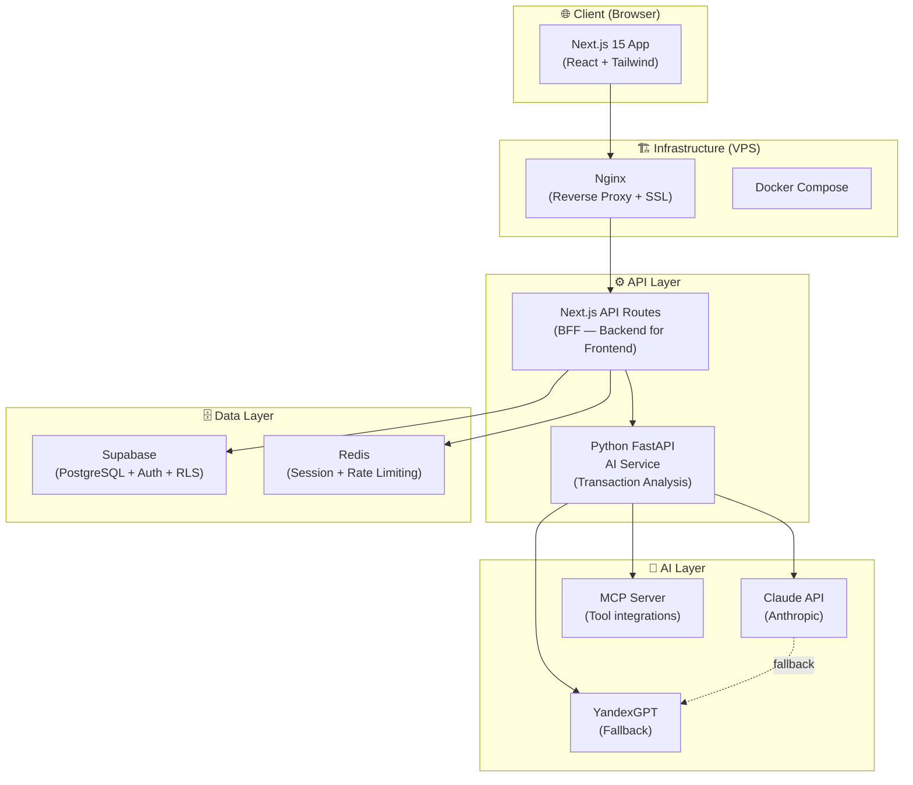

# Architecture: Клёво
**Версия:** 1.0 | **Дата:** 2026-04-08

---

## Architecture Overview

**Стиль:** Distributed Monolith (Monorepo)  
**Контейнеризация:** Docker + Docker Compose  
**Инфраструктура:** VPS (AdminVPS/HOSTKEY)  
**Деплой:** Docker Compose direct deploy (SSH/CI)  
**AI Integration:** MCP серверы + Claude API

---

## High-Level Diagram



---

## Component Breakdown

### 1. Next.js 15 Web App (`apps/web/`)

**Роль:** Основное клиентское приложение + BFF (Backend for Frontend)

| Компонент | Технология | Назначение |
|-----------|-----------|-----------|
| App Router | Next.js 15 | SSR/SSG страницы |
| UI Components | shadcn/ui + Tailwind CSS | Дизайн-система |
| Charts | Recharts | Пай-чарты категорий трат |
| AI Streaming | Vercel AI SDK | Стриминг ответов ростера |
| Auth | Supabase Auth (client) | Авторизация пользователей |
| State | Zustand | Клиентский стейт |

**Ключевые страницы:**
```
/                    → Landing (Паразит-Детектор hook)
/signup              → Регистрация
/onboarding          → Upload CSV / выбор банка
/dashboard           → Топ-5 категорий + история
/roast               → AI Ростер (стриминг)
/chat                → AI чат
/settings            → Профиль + тарифный план
/share/[id]          → Публичная страница шеринга ростера
```

### 2. Python FastAPI AI Service (`apps/ai-service/`)

**Роль:** Анализ транзакций, промпты для ростера, AI логика

| Компонент | Технология | Назначение |
|-----------|-----------|-----------|
| API Framework | FastAPI + uvicorn | HTTP API |
| LLM Client | anthropic-sdk (primary) | Claude API |
| LLM Fallback | yandex-gpt-sdk | YandexGPT |
| Transaction Parser | pandas + csv | Парсинг CSV выписок |
| Prompt Engine | LangChain (optional) | Управление промптами |
| Subscription Detector | Rule-based + AI | Поиск паразитных подписок |

**Ключевые эндпоинты:**
```
POST /analyze          → Анализ CSV, категоризация трат
POST /roast            → Генерация ростера (streaming)
POST /parasites        → Поиск паразитных подписок
POST /chat             → AI чат (streaming)
POST /share/generate   → Генерация карточки для шеринга
```

### 3. Supabase PostgreSQL (`packages/db/`)

**Роль:** Основное хранилище данных + Auth + Row Level Security

**Схема базы данных:**
```sql
-- Пользователи (auth.users от Supabase + расширение)
CREATE TABLE profiles (
  id UUID PRIMARY KEY REFERENCES auth.users(id),
  display_name TEXT,
  plan TEXT DEFAULT 'free' CHECK (plan IN ('free', 'plus', 'pro')),
  plan_expires_at TIMESTAMPTZ,
  created_at TIMESTAMPTZ DEFAULT NOW()
);

-- Транзакции
CREATE TABLE transactions (
  id UUID PRIMARY KEY DEFAULT gen_random_uuid(),
  user_id UUID REFERENCES profiles(id) ON DELETE CASCADE,
  amount DECIMAL(12,2) NOT NULL,
  currency TEXT DEFAULT 'RUB',
  category TEXT,
  description TEXT,
  merchant TEXT,
  transaction_date DATE NOT NULL,
  source TEXT DEFAULT 'csv' CHECK (source IN ('csv', 'manual', 'bank_api', 'sms')),
  is_subscription BOOLEAN DEFAULT FALSE,
  created_at TIMESTAMPTZ DEFAULT NOW()
);

-- Ростеры
CREATE TABLE roasts (
  id UUID PRIMARY KEY DEFAULT gen_random_uuid(),
  user_id UUID REFERENCES profiles(id) ON DELETE CASCADE,
  content TEXT NOT NULL,           -- полный текст ростера
  summary TEXT,                    -- краткое резюме для шеринга
  period_start DATE,
  period_end DATE,
  share_token TEXT UNIQUE,         -- токен для публичной ссылки
  is_public BOOLEAN DEFAULT FALSE,
  created_at TIMESTAMPTZ DEFAULT NOW()
);

-- Цели сбережений (v1)
CREATE TABLE savings_goals (
  id UUID PRIMARY KEY DEFAULT gen_random_uuid(),
  user_id UUID REFERENCES profiles(id) ON DELETE CASCADE,
  title TEXT NOT NULL,
  target_amount DECIMAL(12,2) NOT NULL,
  current_amount DECIMAL(12,2) DEFAULT 0,
  deadline DATE,
  created_at TIMESTAMPTZ DEFAULT NOW()
);

-- Row Level Security
ALTER TABLE transactions ENABLE ROW LEVEL SECURITY;
CREATE POLICY "users_own_transactions" ON transactions
  USING (user_id = auth.uid());

ALTER TABLE roasts ENABLE ROW LEVEL SECURITY;
CREATE POLICY "users_own_roasts" ON roasts
  USING (user_id = auth.uid() OR is_public = TRUE);
```

### 4. Redis (`services/redis/`)

| Назначение | Детали |
|-----------|--------|
| Rate limiting | 10 AI запросов/мин для free пользователей |
| Session cache | JWT refresh tokens |
| Job queue | Async CSV processing jobs |

### 5. Nginx (`services/nginx/`)

| Назначение | Детали |
|-----------|--------|
| Reverse proxy | `/` → Next.js, `/ai/` → FastAPI |
| SSL termination | Let's Encrypt (Certbot) |
| Static files | Кэширование |
| Security headers | CSP, HSTS, X-Frame-Options |

---

## Technology Stack

| Слой | Технология | Версия | Rationale |
|------|-----------|:------:|-----------|
| Frontend | Next.js | 15 | SSR, App Router, AI SDK |
| UI | shadcn/ui + Tailwind | latest | Быстрая разработка, красивый UI |
| Charts | Recharts | 2.x | Как у оригинала Cleo |
| State | Zustand | 4.x | Простой, без boilerplate |
| Backend AI | FastAPI | 0.110+ | Python = нативная AI экосистема |
| LLM Primary | Claude 3.5 Sonnet | latest | Лучший для structured outputs |
| LLM Fallback | YandexGPT 3 | latest | Доступен в РФ без прокси |
| Database | PostgreSQL (Supabase) | 15 | Auth + RLS из коробки |
| Cache | Redis | 7.x | Rate limiting + sessions |
| Proxy | Nginx | 1.25 | Production-grade |
| Containers | Docker | 24+ | |
| Orchestration | Docker Compose | v2 | Direct deploy на VPS |
| CI | GitHub Actions | — | Build + deploy SSH |

---

## Data Architecture

### Transaction Categories (ML + Rule-based)

```python
CATEGORIES = {
  "food_delivery": ["яндекс еда", "delivery club", "самокат", "вкусвилл"],
  "restaurants": ["кафе", "ресторан", "mcdonalds", "burger"],
  "subscriptions": ["netflix", "spotify", "apple", "google", "яндекс плюс"],
  "transport": ["яндекс такси", "uber", "каршеринг", "метро"],
  "groceries": ["пятёрочка", "магнит", "перекрёсток", "лента"],
  "shopping": ["ozon", "wildberries", "вайлдберриз"],
  "utilities": ["жкх", "электроэнергия", "интернет"],
  "entertainment": ["кино", "театр", "спортзал"],
  "savings": ["накопительный", "депозит", "вклад"],
}
```

### CSV Parsing (поддерживаемые форматы)

| Банк | Формат | Поля |
|------|--------|------|
| Т-Банк | CSV UTF-8 | дата, сумма, категория, описание |
| Сбербанк | CSV | дата, сумма, описание, статус |
| Альфа-Банк | XLSX/CSV | дата, сумма, описание |
| Generic | CSV | любые колонки с датой + суммой |

---

## Security Architecture

### Authentication Flow
```
1. User signs up/in → Supabase Auth (JWT)
2. JWT stored in httpOnly cookie (not localStorage)
3. API Routes validate JWT on every request
4. Row Level Security в PostgreSQL
5. AI Service получает только user_id (не email/PII)
```

### API Keys Management
```
# .env.local (server-side only, NEVER client)
ANTHROPIC_API_KEY=sk-ant-...
YANDEX_GPT_API_KEY=...
SUPABASE_SERVICE_ROLE_KEY=...  # только на сервере

# .env.local (client-safe)
NEXT_PUBLIC_SUPABASE_URL=...
NEXT_PUBLIC_SUPABASE_ANON_KEY=...
```

### Данные пользователей
- Транзакции шифруются в покое (Supabase encryption at rest)
- CSV файлы обрабатываются в памяти, не сохраняются на диске
- PII минимизированы: храним только категоризированные транзакции
- Хранилище на VPS в РФ (ФЗ-152 compliance)

---

## Monorepo Structure

```
klevo/
├── apps/
│   ├── web/                    # Next.js 15 app
│   │   ├── app/                # App Router pages
│   │   ├── components/         # UI компоненты
│   │   └── lib/                # Утилиты, hooks
│   └── ai-service/             # Python FastAPI
│       ├── routers/            # API routes
│       ├── services/           # Business logic
│       │   ├── analyzer.py     # Transaction analysis
│       │   ├── roaster.py      # Roast generation
│       │   └── detector.py     # Subscription detection
│       └── prompts/            # Prompt templates
├── packages/
│   ├── db/                     # Supabase client + types
│   ├── ui/                     # Shared shadcn components
│   └── types/                  # Shared TypeScript types
├── services/
│   ├── nginx/                  # Nginx config
│   └── redis/                  # Redis config
├── docker-compose.yml          # Production orchestration
├── docker-compose.dev.yml      # Development
└── CLAUDE.md                   # AI integration guide
```

---

## Scalability Considerations

### MVP (Single VPS)
```yaml
# docker-compose.yml (MVP)
services:
  web: 1 replica
  ai-service: 1 replica  
  postgres: 1 replica (Supabase managed)
  redis: 1 replica
  nginx: 1 replica
```

### v1 (10K MAU)
- Горизонтальное масштабирование web + ai-service
- Redis для rate limiting (защита от AI-API abuse)
- CDN для статических ассетов

### v2 (100K MAU)
- Read replicas для PostgreSQL
- Async queue (Redis + Celery) для тяжёлых операций
- Supabase Edge Functions для геодистрибуции
