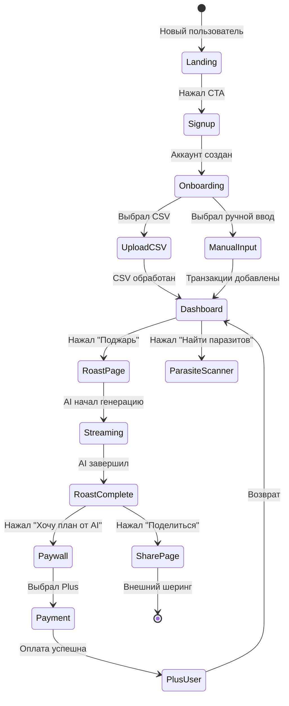

# Pseudocode: Клёво
**Версия:** 1.0 | **Дата:** 2026-04-08

---

## Data Structures

### Transaction
```typescript
type Transaction = {
  id: string           // UUID
  user_id: string      // UUID → profiles
  amount: number       // всегда отрицательный для трат
  currency: 'RUB'
  category: TransactionCategory
  description: string
  merchant: string
  transaction_date: Date
  source: 'csv' | 'manual' | 'bank_api' | 'sms'
  is_subscription: boolean
  created_at: Date
}

type TransactionCategory = 
  | 'food_delivery' | 'restaurants' | 'subscriptions'
  | 'transport' | 'groceries' | 'shopping'
  | 'utilities' | 'entertainment' | 'savings' | 'other'
```

### CategorySummary
```typescript
type CategorySummary = {
  category: TransactionCategory
  total: number       // сумма₽
  percent: number     // % от всех трат
  count: number       // кол-во транзакций
  transactions: Transaction[]
}
```

### Roast
```typescript
type Roast = {
  id: string
  user_id: string
  content: string       // полный текст ростера
  summary: string       // короткая цитата для шеринга (max 280 символов)
  period_start: Date
  period_end: Date
  share_token: string   // короткий токен для публичного URL
  is_public: boolean
  created_at: Date
}
```

---

## Core Algorithms

### Algorithm 1: CSV Parser
```
INPUT: file: File (CSV)
OUTPUT: transactions: Transaction[] OR Error

STEPS:
1. Read file content (max 5MB, else error "файл слишком большой")
2. Detect encoding (UTF-8 or Windows-1251 for Russian files)
3. Detect bank format by column headers:
   - IF headers contain "Дата операции", "Сумма операции" → T-Bank format
   - IF headers contain "Дата", "Сумма" → Generic format
   - IF headers contain "Дата проводки" → Sberbank format
   - ELSE → try Generic format with fuzzy matching
4. Parse rows:
   FOR EACH row in CSV:
     - Extract date (parse multiple date formats: DD.MM.YYYY, YYYY-MM-DD)
     - Extract amount (convert comma-decimal to float, make negative if expense)
     - Extract description/merchant
     - SKIP if amount > 0 AND source != 'income_tracking'
     - SKIP if row is header, empty, or total
5. Deduplicate (same date + amount + description = duplicate)
6. RETURN transactions array (sorted by date DESC)

ERROR CASES:
  - File > 5MB → "Файл слишком большой. Максимум 5 МБ"
  - Zero parsed transactions → "Не нашли транзакций. Убедись, что загружаешь выписку расходов"
  - Parse errors > 50% → "Формат не поддерживается. Попробуй другой банк"

COMPLEXITY: O(n) where n = number of rows
```

### Algorithm 2: Transaction Categorizer
```
INPUT: transactions: Transaction[]
OUTPUT: transactions: Transaction[] (with categories filled)

STEPS:
1. Load category patterns (keywords → category mapping)
2. FOR EACH transaction:
   a. Normalize description: lowercase, remove punctuation
   b. TRY rule-based match:
      FOR EACH (pattern, category) in PATTERNS:
        IF normalized_description contains pattern → assign category, BREAK
   c. IF no rule match:
      - Build AI prompt: "Категоризируй транзакцию: '{description}'"
      - Batch 20 transactions per AI request (cost optimization)
      - Parse response, assign categories
   d. IF AI fails or uncertain: assign 'other'
3. RETURN categorized transactions

OPTIMIZATION: Cache AI categorizations by merchant name
COMPLEXITY: O(n * k) rule-based; O(n/20) AI calls
```

### Algorithm 3: Parasite Detector
```
INPUT: transactions: Transaction[]
OUTPUT: parasites: Subscription[]

STEPS:
1. Group transactions by normalized merchant name
2. FOR EACH merchant_group:
   a. Sort by date
   b. CHECK for recurring pattern:
      - Calculate intervals between charges (days)
      - IF std_deviation(intervals) < 5 days AND count >= 2:
        - Classify as subscription
        - Estimate monthly_amount from charge amount
        - Mark is_subscription = TRUE
   c. CHECK last_charge_date:
      - IF last_charge_date > 30 days ago → mark as "possibly inactive"
3. FILTER by confidence threshold:
   - HIGH confidence: regular interval + known subscription keyword
   - MEDIUM: regular interval only
   - LOW: irregular but repeating → mark with [H] hypothesis flag
4. SORT by monthly_amount DESC (biggest waste first)
5. RETURN top-20 parasites

KNOWN SUBSCRIPTIONS LIST (seed):
  "netflix", "spotify", "apple one", "яндекс плюс", "vk музыка",
  "canva", "headspace", "adobe", "notion", "github"

COMPLEXITY: O(n log n) for sorting
```

### Algorithm 4: Roast Generator (AI Prompt)
```
INPUT: user_id, period, categories: CategorySummary[], parasites: Subscription[]
OUTPUT: roast_stream: AsyncIterator<string>

STEPS:
1. Prepare context:
   - top_category = categories[0]  // highest spend
   - shocking_stat = find_most_surprising_stat(categories)
     // e.g., "₽12,400 на доставку > квартплата"
   - parasite_count = parasites.length
   - total_wasted = sum(parasites.monthly_amount)

2. Build system prompt:
   """
   Ты — Клёво, дружелюбный и честный AI-финансовый советник.
   Твой стиль: юмористичный, но не обидный. Как лучший друг,
   который говорит правду с улыбкой. Используй современный
   русский молодёжный язык (без матов). Максимум 300 слов.
   Добавляй 1-2 эмодзи для живости.
   """

3. Build user prompt:
   """
   Поджарь расходы этого человека за {period}:
   - Топ трата: {top_category.name} — ₽{top_category.total}
   - Всего потрачено: ₽{total_spent}
   - Топ-5 категорий: {categories_list}
   - Лишних подписок: {parasite_count} штук, ₽{total_wasted}/мес
   - Самый шокирующий факт: {shocking_stat}
   
   Структура ответа:
   1. Ударная фраза (одно предложение, самый жёсткий факт)
   2. Основной ростер (2-3 абзаца)
   3. 2 конкретных совета по улучшению
   """

4. Stream response from Claude API (anthropic.messages.stream)
5. AFTER streaming completes:
   - Extract summary (first 280 chars)
   - Save roast to DB with share_token
   - RETURN {roast_id, share_token}

FALLBACK (if Claude fails):
  → Retry once
  → IF fails again → switch to YandexGPT with adapted prompt
  → IF YandexGPT fails → return pre-written generic roast template

COST OPTIMIZATION:
  - Average roast = ~600 tokens input + ~400 tokens output
  - Cache roast templates for similar spending patterns
```

---

## API Contracts

### GET /api/dashboard
```typescript
Request:
  Headers: { Authorization: Bearer <supabase_jwt> }
  Query: { period?: '1month' | '3months' | '6months' }

Response (200):
{
  categories: CategorySummary[],
  total_spent: number,
  period: { start: string, end: string },
  parasites_count: number,
  has_roast_this_month: boolean,
  user_plan: 'free' | 'plus' | 'pro'
}

Response (401): { error: { code: 'UNAUTHORIZED' } }
Response (404): { error: { code: 'NO_DATA', message: 'Загрузи выписку для начала' } }
```

### POST /api/upload
```typescript
Request:
  Headers: { Authorization: Bearer <jwt>, Content-Type: multipart/form-data }
  Body: FormData { file: File, bank?: 'tbank' | 'sber' | 'alfa' | 'auto' }

Response (200):
{
  transactions_count: number,
  period: { start: string, end: string },
  categories: CategorySummary[],
  parasites: Subscription[]
}

Response (400): { error: { code: 'PARSE_ERROR', message: string } }
Response (413): { error: { code: 'FILE_TOO_LARGE', message: 'Максимум 5 МБ' } }
```

### POST /api/roast (Server-Sent Events)
```typescript
Request:
  Headers: { Authorization: Bearer <jwt> }
  Body: { period?: '1month' | '3months' | 'all' }

Response: text/event-stream
event: token
data: {"text": "Слушай,"}

event: token  
data: {"text": " значит"}

event: done
data: {"roast_id": "uuid", "share_token": "abc123", "summary": "..."}

Response (429): { error: { code: 'RATE_LIMIT', retry_after: 3600 } }  // free plan limit
```

---

## State Transitions


