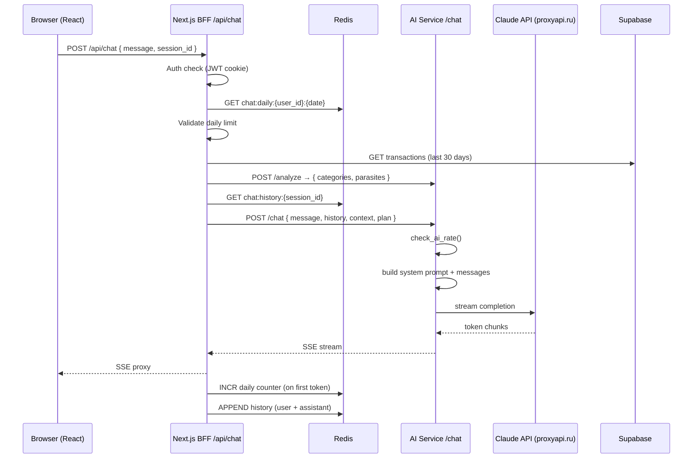

# Architecture: AI Chat

## Overview

Чат следует той же BFF-паттерн что и roast-mode: Next.js собирает контекст, проксирует стриминг из AI Service. Новое: Redis хранит историю сессии в AI Service, daily limit в BFF.

## Component Diagram



## New Components

### apps/ai-service/routers/chat_router.py
- `POST /chat` — принимает ChatRequest, генерирует SSE стриминг
- Переиспользует `generate_roast` паттерн для стриминга
- Переиспользует `check_ai_rate` из rate_limiter

### apps/ai-service/services/chat_generator.py
- `generate_chat_response(req: ChatRequest) → AsyncGenerator[str]`
- System prompt с финансовым контекстом
- Messages array из history + новое сообщение
- Claude primary, YandexGPT fallback

### apps/web/app/api/chat/route.ts
- BFF endpoint: auth → daily limit → context → proxy SSE
- Redis для history и daily counter

### apps/web/app/chat/page.tsx
- `'use client'` — интерактивный чат
- EventSource / fetch ReadableStream для SSE
- Quick reply кнопки
- Typing indicator во время стриминга

### packages/db/schema/005_chat.sql
- `chat_messages` table (Plus plan persistence)
- RLS: SELECT/INSERT только свои записи

## Redis Key Schema

```
chat:daily:{user_id}:{YYYY-MM-DD}   TTL = до конца дня UTC
chat:history:{session_id}            TTL = 3600s (1 час)
```

## Consistency with Project Architecture

- BFF pattern: Next.js не имеет прямого доступа к Claude API ✅
- Auth: JWT httpOnly cookie, проверяется в BFF ✅
- RLS: chat_messages защищены по user_id ✅
- Secrets: CLAUDE_API_KEY только в AI Service ✅
- Streaming: SSE через `text/event-stream` ✅
- Rate limiting: Redis sliding window (существующий паттерн) ✅

## ADR: История сессии в Redis (не DB)

**Решение:** История в Redis с TTL 1 час, не в PostgreSQL.

**Причины:**
- Скорость: Redis O(1) vs DB O(log n)
- Сессии эфемерны: пользователь не ожидает persistence между вкладками (v1)
- Persistence — Plus feature в v2

**Trade-off:** При падении Redis история теряется. Митигация: деградируем gracefully (начинаем чат без истории).
