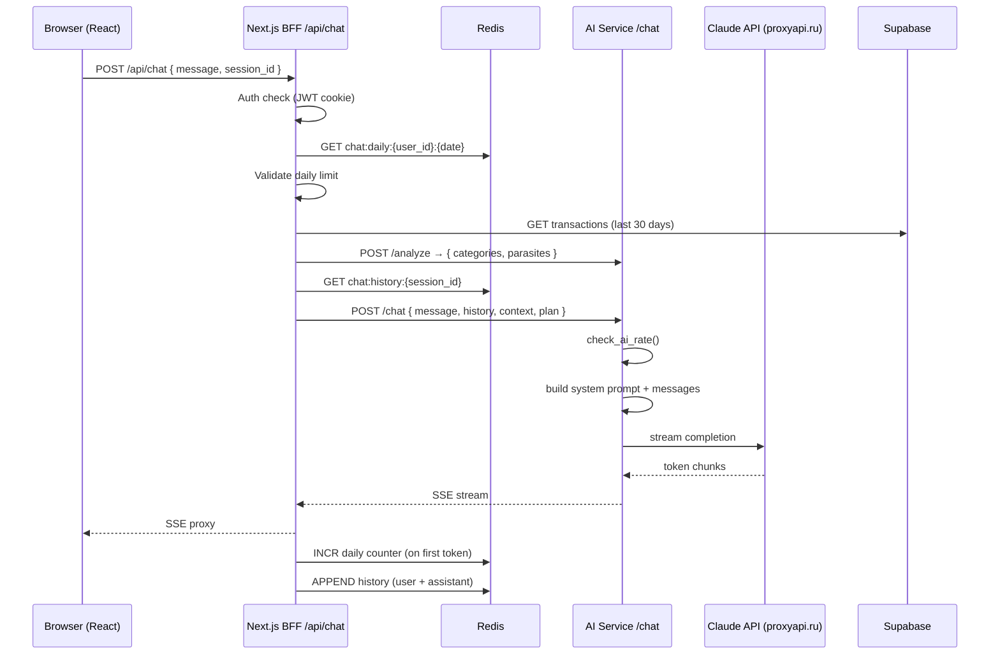

# Architecture: AI Chat

## Overview

Чат следует той же BFF-паттерн что и roast-mode: Next.js собирает контекст, проксирует стриминг из AI Service. Новое: Redis хранит историю сессии в AI Service, daily limit в BFF.

## Component Diagram



## New Components

### apps/ai-service/routers/chat_router.py
- `POST /chat` — принимает ChatRequest, генерирует SSE стриминг
- Переиспользует `generate_roast` паттерн для стриминга
- Переиспользует `check_ai_rate` из rate_limiter

### apps/ai-service/services/chat_generator.py
- `generate_chat_response(req: ChatRequest) → AsyncGenerator[str]`
- System prompt с финансовым контекстом
- Messages array из history + новое сообщение
- Claude primary, YandexGPT fallback

### apps/web/app/api/chat/route.ts
- BFF endpoint: auth → daily limit → context → proxy SSE
- Redis для history и daily counter

### apps/web/app/chat/page.tsx
- `'use client'` — интерактивный чат
- EventSource / fetch ReadableStream для SSE
- Quick reply кнопки
- Typing indicator во время стриминга

### packages/db/schema/005_chat.sql
- `chat_messages` table (Plus plan persistence)
- RLS: SELECT/INSERT только свои записи

## Redis Key Schema

```
chat:daily:{user_id}:{YYYY-MM-DD}     TTL = seconds_until_midnight_UTC()
chat:history:{user_id}:{session_id}   TTL = 3600s (1 час)
chat:context:{user_id}:{YYYY-MM-DD}   TTL = 3600s — кеш /analyze результата
```

Note: `chat:history` ключ включает `user_id` для изоляции сессий.
`REDIS_URL` должен быть одинаковым для BFF (Next.js) и AI Service — единый Redis instance.

## Consistency with Project Architecture

- BFF pattern: Next.js не имеет прямого доступа к Claude API ✅
- Auth: JWT httpOnly cookie, проверяется в BFF ✅
- RLS: chat_messages защищены по user_id ✅
- Secrets: CLAUDE_API_KEY только в AI Service ✅
- Streaming: SSE через `text/event-stream` ✅
- Rate limiting: Redis sliding window — **отдельный метод `check_chat_rate(limit=10)`** ✅
  (не переиспользует `check_ai_rate` напрямую — у чата иные лимиты, чем у roast)

## Context Caching: /analyze результат

Каждый чат-запрос НЕ вызывает `/analyze` повторно. BFF кеширует результат:

```
cache_key = "chat:context:{user_id}:{YYYY-MM-DD}"  TTL = 3600s

GET cache_key → если есть, использовать
Если нет:
  context = POST /analyze
  SET cache_key context EX 3600
```

Это предотвращает N × `/analyze` вызовов за одну chat-сессию (N = количество сообщений).

## ADR: Отдельный rate limit для чата

**Решение:** `check_chat_rate(user_id, limit=10)` — новый метод в RateLimiter, не изменяет `check_ai_rate`.

**Причина:** `check_ai_rate` используется для roast-mode с лимитом 10 req/min. Чат также 10 req/min, но в будущем лимиты могут расходиться. Параметризованный метод даёт гибкость без копирования кода.

## ADR: История сессии в Redis (не DB)

**Решение:** История в Redis с TTL 1 час, не в PostgreSQL.

**Причины:**
- Скорость: Redis O(1) vs DB O(log n)
- Сессии эфемерны: пользователь не ожидает persistence между вкладками (v1)
- Persistence — Plus feature в v2

**Trade-off:** При падении Redis история теряется. Митигация: деградируем gracefully (начинаем чат без истории).
