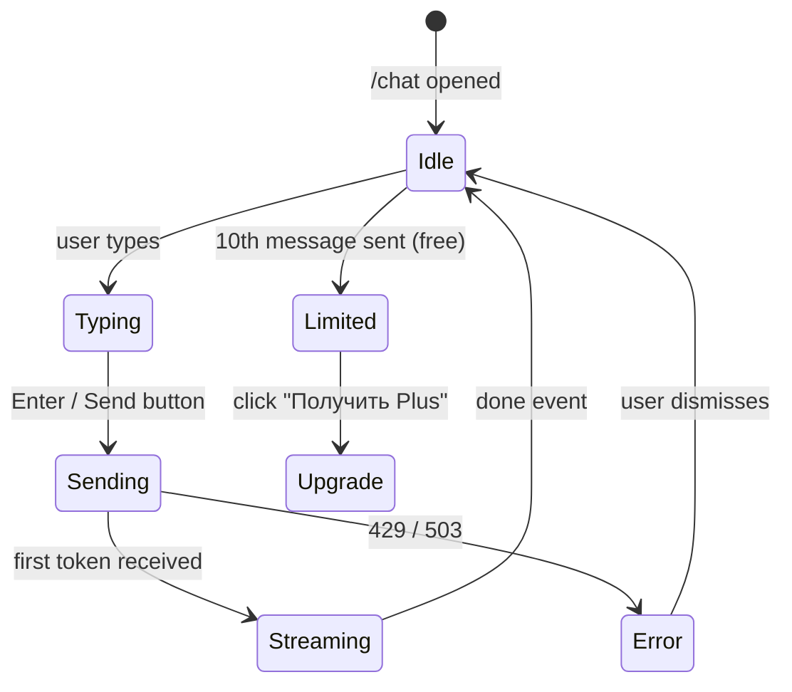

# Pseudocode: AI Chat

## Data Structures

```typescript
type ChatMessage = {
  role: 'user' | 'assistant'
  content: string
}

type ChatContext = {
  total_spent: number
  top_categories: { name: string; percent: number; total: number }[]
  parasites: { name: string; amount_per_month: number }[]
  period: string
}

type ChatRequest = {
  user_id: string
  session_id: string
  message: string
  history: ChatMessage[]
  context: ChatContext
  plan: 'free' | 'plus'
}
```

## Algorithm 1: BFF Chat Handler (Next.js)

```
POST /api/chat

INPUT: { message, session_id }
OUTPUT: SSE stream OR error JSON

STEPS:
1. auth = await getUser()
   IF NOT auth → return 401 UNAUTHORIZED

2. VALIDATE message:
   IF message empty OR length > 1000 → return 400 VALIDATION_ERROR

3. CHECK daily limit:
   IF plan == 'free':
     count = redis.get("chat:daily:{user_id}:{today_utc}")
     IF count >= 10 → return 429 DAILY_LIMIT with upgrade_url

4. FETCH financial context:
   transactions = supabase.from('transactions')
     .select('*')
     .eq('user_id', user.id)
     .gte('transaction_date', 30_days_ago)
   
   IF transactions.length == 0 → return 422 NO_TRANSACTIONS

   context = await fetch(AI_SERVICE/analyze, { transactions })
   // Returns { categories, parasites, total_spent }

5. FETCH session history from Redis:
   history = redis.get("chat:history:{session_id}") ?? []
   // Keep last 10 pairs (20 messages)

6. PROXY to AI Service:
   aiResponse = await fetch(AI_SERVICE/chat, {
     user_id, session_id, message,
     history: history.slice(-20),
     context: { top_categories: context.categories[:5], parasites: context.parasites[:3], ... },
     plan
   })

7. IF aiResponse.status == 429 → return 429 RATE_LIMIT

8. ON first token received:
   IF plan == 'free':
     redis.incr("chat:daily:{user_id}:{today_utc}", EX: seconds_until_midnight)
   
   // Append user message to history
   redis.append("chat:history:{session_id}", { role: 'user', content: message })
   redis.expire("chat:history:{session_id}", 3600)

9. STREAM SSE response to client

10. ON done event:
    assistant_content = accumulated tokens
    redis.append("chat:history:{session_id}", { role: 'assistant', content: assistant_content })
```

## Algorithm 2: AI Service Chat Endpoint

```python
POST /chat

INPUT: ChatRequest
OUTPUT: SSE stream

STEPS:
1. CHECK per-minute rate limit:
   result = limiter.check_ai_rate(user_id)
   IF NOT result.allowed → raise 429 RATE_LIMIT

2. BUILD system prompt:
   system = f"""
   Ты — Клёво, дружелюбный финансовый советник с характером для российской молодёжи.
   Отвечай кратко (2-4 предложения), с лёгким юмором, но по делу.
   Всегда давай конкретный совет в конце.
   
   Финансы пользователя (последний месяц):
   Потрачено: {context.total_spent} ₽
   Топ категории:
   {format_categories(context.top_categories)}
   Паразитные подписки: {format_parasites(context.parasites)}
   """

3. BUILD messages array:
   messages = [
     *history,          // last 10 pairs
     { role: 'user', content: message }
   ]

4. CALL Claude API (streaming):
   TRY:
     stream = claude.messages.stream(
       model='claude-sonnet-4-6',
       system=system,
       messages=messages,
       max_tokens=512,
       timeout=8s  // first token timeout
     )
     FOR chunk IN stream:
       YIELD f"event: token\ndata: {json(text=chunk)}\n\n"
   
   EXCEPT TimeoutError:
     FALLBACK to YandexGPT (same pattern as roast_generator)
   
   YIELD f"event: done\ndata: {json(message_id=uuid4())}\n\n"
```

## Algorithm 3: Daily Limit Check

```
CHECK_DAILY_LIMIT(user_id, plan):
  IF plan == 'plus' → RETURN allowed=True, remaining=∞

  today = datetime.now(UTC).strftime('%Y-%m-%d')
  key = f"chat:daily:{user_id}:{today}"
  
  count = redis.get(key) ?? 0
  IF count >= 10:
    seconds_left = seconds_until_midnight_UTC()
    RETURN allowed=False, retry_after=seconds_left, remaining=0
  
  RETURN allowed=True, remaining=10 - count

CONSUME_DAILY_CHAT(user_id):
  today = datetime.now(UTC).strftime('%Y-%m-%d')
  key = f"chat:daily:{user_id}:{today}"
  ttl = seconds_until_midnight_UTC()
  
  redis.pipeline():
    INCR key
    EXPIRE key ttl
  EXECUTE
```

## State Transitions



## Error Handling

| Error | Where | Response |
|-------|-------|----------|
| AI timeout (>8s) | AI Service | Fallback to YandexGPT |
| YandexGPT fails | AI Service | SSE error event → client shows retry |
| Daily limit | BFF | 429 + upgrade CTA |
| No transactions | BFF | 422 + "Загрузи выписку" |
| Redis unavailable | BFF | Degrade: skip history, allow message |
