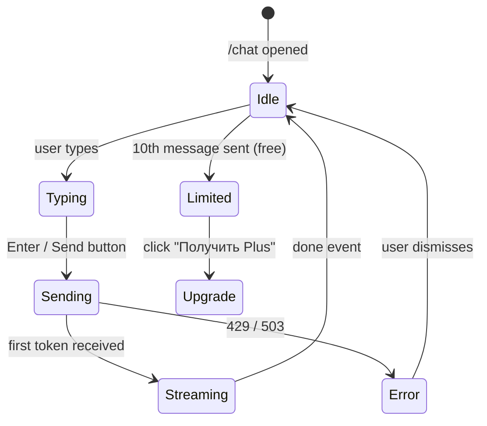

# Pseudocode: AI Chat

## Data Structures

```typescript
type ChatMessage = {
  role: 'user' | 'assistant'
  content: string
}

type ChatContext = {
  total_spent: number
  top_categories: { name: string; percent: number; total: number }[]
  parasites: { name: string; amount_per_month: number }[]
  period: string
}

type ChatRequest = {
  user_id: string
  session_id: string
  message: string
  history: ChatMessage[]
  context: ChatContext
  plan: 'free' | 'plus'
}
```

## Algorithm 1: BFF Chat Handler (Next.js)

```
POST /api/chat

INPUT: { message, session_id }
OUTPUT: SSE stream OR error JSON

STEPS:
1. auth = await getUser()
   IF NOT auth → return 401 UNAUTHORIZED

2. VALIDATE message:
   IF message empty OR length > 1000 → return 400 VALIDATION_ERROR

3. FETCH user plan (from profiles):
   profile = supabase.from('profiles').select('plan, plan_expires_at').eq('id', user.id)
   now = datetime.now(UTC)
   plan = 'plus' IF (profile.plan != 'free' AND profile.plan_expires_at > now) ELSE 'free'

4. CHECK daily limit (atomic):
   today = datetime.now(UTC).strftime('%Y-%m-%d')
   limit = 10 IF plan == 'free' ELSE 100
   result = ATOMIC_CHECK_AND_CONSUME("chat:daily:{user_id}:{today}", limit, seconds_until_midnight_UTC())
   IF result == -1 → return 429 DAILY_LIMIT with upgrade_url

5. FETCH financial context (with cache):
   cache_key = "chat:context:{user_id}:{today}"
   context = redis.get(cache_key)
   IF context is null:
     transactions = supabase.from('transactions')
       .select('*')
       .eq('user_id', user.id)
       .gte('transaction_date', 30_days_ago)
     IF transactions.length == 0:
       // Decrement counter — no AI call was made
       redis.decr("chat:daily:{user_id}:{today}")
       return 422 NO_TRANSACTIONS
     context = await fetch(AI_SERVICE/analyze, { transactions })
     // Returns { categories, parasites, total_spent }
     redis.set(cache_key, JSON.stringify(context), EX: 3600)
   ELSE:
     context = JSON.parse(context)

6. FETCH session history from Redis:
   history_key = "chat:history:{user_id}:{session_id}"
   raw = redis.lrange(history_key, -20, -1)  // last 20 items = 10 pairs
   history = raw.map(JSON.parse)

7. PROXY to AI Service:
   aiResponse = await fetch(AI_SERVICE/chat, {
     user_id, session_id, message,
     history,
     context: {
       total_spent: context.total_spent,
       top_categories: context.categories.slice(0, 5),
       parasites: context.parasites.slice(0, 3),
       period: "last_month"
     },
     plan
   })

8. IF aiResponse.status == 429 → return 429 RATE_LIMIT
   IF aiResponse.status >= 500 → return 503 INTERNAL_ERROR
   IF NOT aiResponse.ok → return 503 INTERNAL_ERROR

9. APPEND user message to history:
   redis.rpush(history_key, JSON.stringify({ role: 'user', content: message }))
   redis.ltrim(history_key, -20, -1)   // keep last 20 items
   redis.expire(history_key, 3600)

10. STREAM SSE response to client, accumulate assistant_content

11. ON done event (stream complete):
    redis.rpush(history_key, JSON.stringify({ role: 'assistant', content: assistant_content }))
    redis.ltrim(history_key, -20, -1)
    redis.expire(history_key, 3600)
```

## Algorithm 2: AI Service Chat Endpoint

```python
POST /chat

INPUT: ChatRequest
OUTPUT: SSE stream

STEPS:
1. CHECK per-minute rate limit:
   result = limiter.check_chat_rate(user_id)  // limit=10 req/min, separate from check_ai_rate
   IF NOT result.allowed → raise 429 RATE_LIMIT

2. BUILD system prompt:
   system = f"""
   Ты — Клёво, дружелюбный финансовый советник с характером для российской молодёжи.
   Отвечай кратко (2-4 предложения), с лёгким юмором, но по делу.
   Всегда давай конкретный совет в конце ответа.
   
   Финансы пользователя (последний месяц):
   Потрачено: {context.total_spent:.0f} ₽
   
   Топ категории расходов:
   {format_categories(context.top_categories)}
   
   Паразитные подписки:
   {format_parasites(context.parasites)}
   """

3. BUILD messages array:
   messages = [
     *history,                                  // last 10 pairs (max 20 items)
     { "role": "user", "content": message }
   ]

4. CALL Claude API (streaming):
   TRY:
     stream = claude.messages.stream(
       model='claude-sonnet-4-6',
       system=system,
       messages=messages,
       max_tokens=512,
       timeout=8s  // first-token timeout
     )
     FOR chunk IN stream:
       YIELD f"event: token\ndata: {json({'text': chunk})}\n\n"
   
   EXCEPT (TimeoutError, ConnectionError, APIStatusError):
     // Fallback: YandexGPT
     TRY:
       yandex_response = await call_yandexgpt(system, messages, max_tokens=512)
       FOR chunk IN yandex_response:
         YIELD f"event: token\ndata: {json({'text': chunk})}\n\n"
     EXCEPT:
       // Both AI providers failed — send error event
       YIELD f"event: error\ndata: {json({'code': 'AI_UNAVAILABLE'})}\n\n"
       RETURN  // do NOT yield done event on error
   
   YIELD f"event: done\ndata: {json({'message_id': str(uuid4())})}\n\n"
```

## Algorithm 3: Atomic Daily Limit (Lua script — no race condition)

```
ATOMIC_CHECK_AND_CONSUME(key, limit, ttl):
  // Lua script executes atomically in Redis
  LUA:
    local count = tonumber(redis.call('GET', KEYS[1])) or 0
    if count >= tonumber(ARGV[1]) then
      return -1  -- limit exceeded
    end
    local new_count = redis.call('INCR', KEYS[1])
    if new_count == 1 then
      redis.call('EXPIRE', KEYS[1], ARGV[2])  -- set TTL only on first increment
    end
    return new_count

RESULT: -1 → limit exceeded; positive integer → current count (allowed)

SECONDS_UNTIL_MIDNIGHT_UTC():
  now = datetime.now(UTC)
  midnight = datetime(now.year, now.month, now.day, 0, 0, 0, tzinfo=UTC) + timedelta(days=1)
  RETURN int((midnight - now).total_seconds())

FORMAT_CATEGORIES(categories):
  // Builds human-readable section for system prompt
  lines = []
  FOR cat IN categories:
    lines.append(f"- {cat.name}: {cat.percent}% ({cat.total:.0f} ₽)")
  RETURN "\n".join(lines)

FORMAT_PARASITES(parasites):
  IF parasites is empty: RETURN "подписок-паразитов не обнаружено"
  lines = []
  FOR p IN parasites:
    lines.append(f"- {p.name}: ~{p.amount_per_month:.0f} ₽/мес")
  RETURN "\n".join(lines)
```

## State Transitions



## Error Handling

| Error | Where | Response |
|-------|-------|----------|
| AI timeout (>8s) | AI Service | Fallback to YandexGPT |
| YandexGPT fails | AI Service | SSE error event → client shows retry |
| Daily limit | BFF | 429 + upgrade CTA |
| No transactions | BFF | 422 + "Загрузи выписку" |
| Redis unavailable | BFF | Degrade: skip history, allow message |
