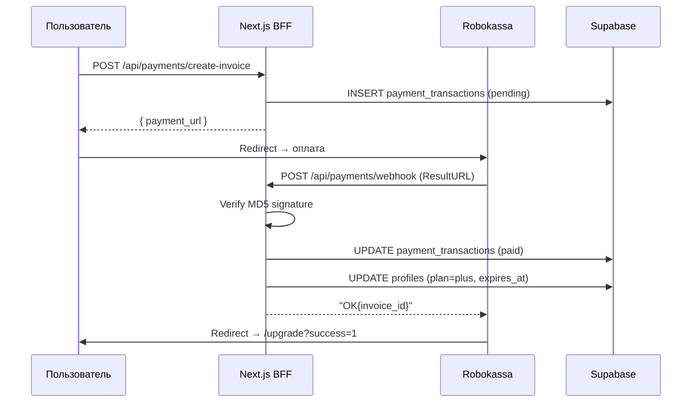

# Architecture: Upgrade to Plus

## Компоненты

```
Browser
  └─ app/upgrade/page.tsx           — /upgrade страница (Client Component)
       UpgradePlansCard              — сравнение планов
       POST /api/payments/create-invoice → redirect Robokassa
       /upgrade?success=1            — success state

Next.js BFF
  ├─ app/api/payments/create-invoice/route.ts
  │    auth → check plan → generate invoice → build Robokassa URL
  ├─ app/api/payments/webhook/route.ts
  │    (PUBLIC — без JWT) verify MD5 → update DB → "OK{id}"
  └─ app/api/payments/status/route.ts
       auth → return profile.plan + plan_expires_at

Python AI Service
  └─ services/rate_limiter.py (modified)
       check_roast_allowed() — добавить plan check перед monthly limit

Supabase PostgreSQL
  ├─ profiles: plan, plan_expires_at (already exists)
  └─ payment_transactions: NEW table

Robokassa (external)
  ├─ Payment page (redirect)
  ├─ ResultURL → POST /api/payments/webhook
  ├─ SuccessURL → /upgrade?success=1
  └─ FailURL → /upgrade?failed=1
```

## Диаграмма: Payment Flow



## Размещение файлов (новые)

```
apps/web/
├── app/
│   ├── upgrade/
│   │   └── page.tsx                    — /upgrade страница
│   └── api/payments/
│       ├── create-invoice/route.ts     — генерация invoice
│       ├── webhook/route.ts            — Robokassa callback (PUBLIC)
│       └── status/route.ts            — текущий план пользователя
├── lib/
│   └── robokassa.ts                    — signature utils

apps/ai-service/
└── services/rate_limiter.py           — MODIFIED: plan check

packages/db/schema/
└── 004_payments.sql                   — payment_transactions table + RLS
```

## Security Architecture

### Webhook (критично)
- Webhook endpoint `/api/payments/webhook` — НЕ требует JWT (Robokassa не знает о нашей сессии)
- Вместо этого: MD5 signature verification с Password2
- Password2 ≠ Password1 (разные секреты для request/result)
- Проверка выполняется ПЕРЕД любыми DB изменениями

### Idempotency
- InvoiceId UNIQUE в payment_transactions
- Повторный webhook с тем же InvoiceId → уже `status=paid` → return OK без изменений

### Secrets
```
ROBOKASSA_MERCHANT_LOGIN  — не секрет (можно в env)
ROBOKASSA_PASSWORD1       — секрет! (для создания подписи в create-invoice)
ROBOKASSA_PASSWORD2       — секрет! (для проверки webhook)
```

### Plan Expiry Check
- `plan_expires_at` проверяется при каждом roast запросе (не pre-cron)
- On-demand downgrade: если истёк → `plan='free'`, `plan_expires_at=null`
- Нет фоновых джобов — проще, надёжнее

## Technology Choices

| Компонент | Выбор | Причина |
|-----------|-------|---------|
| Платёжная система | Robokassa | ФЗ-152, РФ рынок, задано в ТЗ |
| Signature algo | MD5 (Robokassa стандарт) | Требование Robokassa |
| Plan storage | PostgreSQL profiles | Уже есть, simple |
| Payment history | payment_transactions | Аудит, idempotency |
| Recurring | Manual (v1) | Проще, нет рисков |

## ADR: Почему create-invoice в Next.js, а не AI service

Платёжная логика не связана с AI. AI service — domain для CSV parsing и roast generation. Payment = user management = BFF domain. Меньше cross-service зависимостей.
